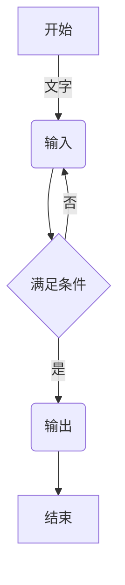
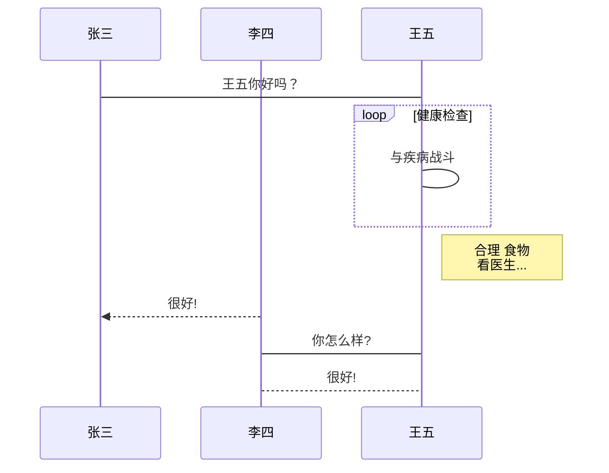
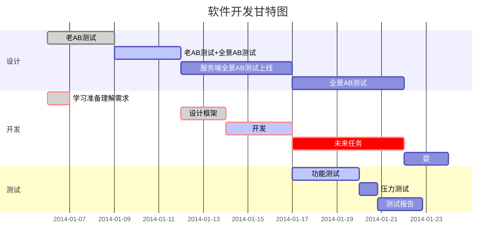

## Markdown DEMO

### 1.文本

- 倾斜 `*文本*`

  _文本_

- 粗体 `**文本**`

  **文本**

- 倾斜+粗体 `***文本***`

  **_文本_**

- 删除线 `~~文本~~`

  ~~文本~~

- 背景色 `==文本==`
  ==文本==

### 2.标题

- h1 `# 标题`

  # h1

- h2 `## 标题`

  ## h2

- 以此类推共六级标题

### 3.引用

`> 引用内容`

> 引用内容
>
> > 引用内容 2

### 4.分割线

`---`或`***`

---

### 5.图片

``


### 6.超链接

`[超链接名](超链接地址 "超链接title")`

[oldbig9](https://oldbig9.github.io/hugo-blog)

### 7.列表

- 无序列表

  - 无序列表 \- 使用 \- \+ \* 任何一种都行

  - 无序列表 \+

  - 无序列表 \*

- 有序列表 数字加点

  1. 列表 1
  2. 列表 2

列表嵌套:上一级和下一级之间敲三个空格

### 8.表格

```
表头|表头|表头
:---|:---:|---:
内容|内容|内容
```

| 字段 |  类型  | 描述 |
| :--- | :----: | ---: |
| id   |  int   | 主键 |
| name | string | 名称 |

### 9.代码

- 单行代码 \`单行代码\`

- 多行代码

  ````
  ​```php
  public function demo(){
      echo 'hello world';
  }
  ​```
  ````

```php
public function demo(){
    echo 'hello world';
}
```

### 10.图表 mermaid

- mermaid 流程图

  ````
  ​```mermaid
  graph TD
  A[开始] -->|文字| B(输入)
  B --> C{满足条件}
  C -->|是| D(输出)
  C -->|否| B
  D --> E[结束]
  ​```
  ````



- mermaid 时序图

  ````
  ​```mermaid
  %% 时序图例子,-> 直线，-->虚线，->>实线箭头
    sequenceDiagram
      participant 张三
      participant 李四
      张三->王五: 王五你好吗？
      loop 健康检查
          王五->王五: 与疾病战斗
      end
      Note right of 王五: 合理 食物 <br/>看医生...
      李四-->>张三: 很好!
      王五->李四: 你怎么样?
      李四-->王五: 很好!
  ​```
  ````



- mermaid 甘特图

  ````
  ​```mermaid
  %% 语法示例
          gantt
          dateFormat  YYYY-MM-DD
          title 软件开发甘特图
          section 设计
          需求                      :done,    des1, 2014-01-06,2014-01-08
          原型                      :active,  des2, 2014-01-09, 3d
          UI设计                     :         des3, after des2, 5d
      未来任务                     :         des4, after des3, 5d
          section 开发
          学习准备理解需求                      :crit, done, 2014-01-06,24h
          设计框架                             :crit, done, after des2, 2d
          开发                                 :crit, active, 3d
          未来任务                              :crit, 5d
          耍                                   :2d
          section 测试
          功能测试                              :active, a1, after des3, 3d
          压力测试                               :after a1  , 20h
          测试报告                               : 48h
  ​```
  ````



### 11.数学公式

$$
E = mc^2
$$

### emoji

```
:frog:
```

:frog:
